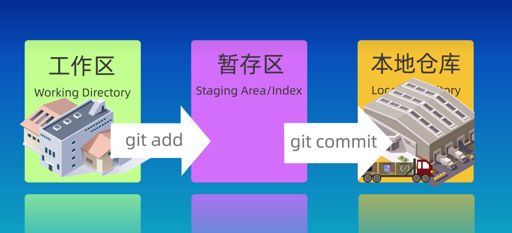
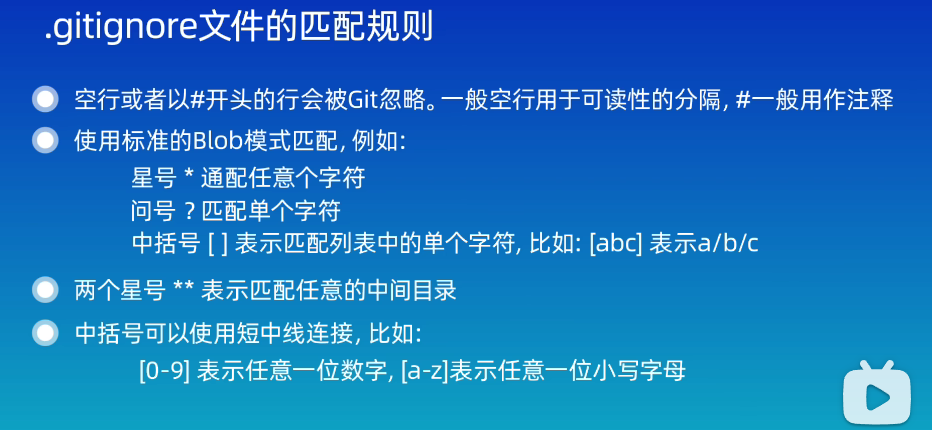
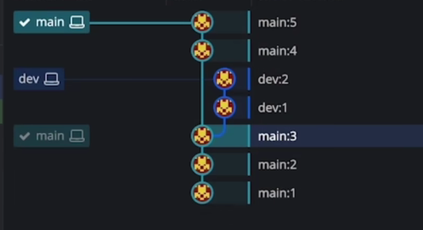
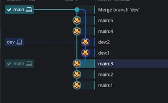
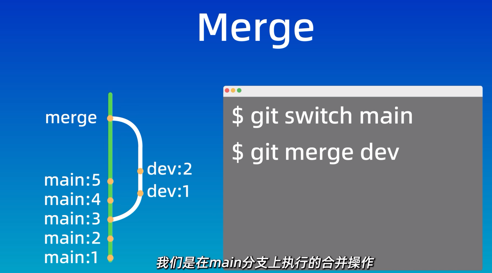
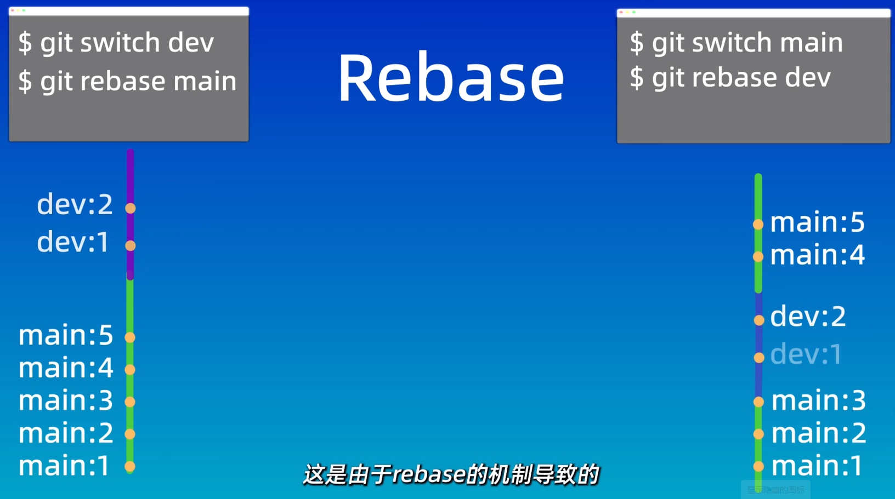
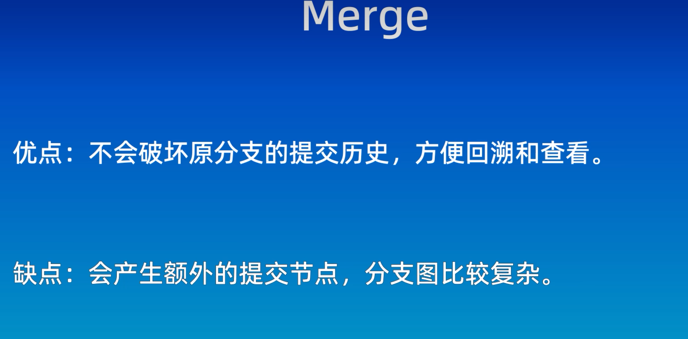

## 1.基本命令和概念

工作区、暂存区、本地仓库

git reset的三种模式

删除文件

使用.gitignore忽略文件

在SSH配置后可用 git clone关联远程仓库

## 2.分支
### (1)merger
* 1.git branch dev 和 git switch/checkout dev 实现创建分支和切换分支
* 2.图形化如下
  
* 3.合并 在main分支合并dev分支 git merge dev(产生冲突后需手动解决冲突，选择最终结果)
 
* 4.删除已合并后的分支 git branch -d dev
### (2)rebase
切换到main分支上,合并dev分支：

效果图如下：

### （3）优缺点和区别

