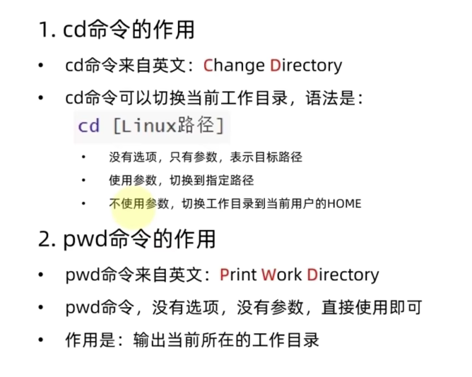
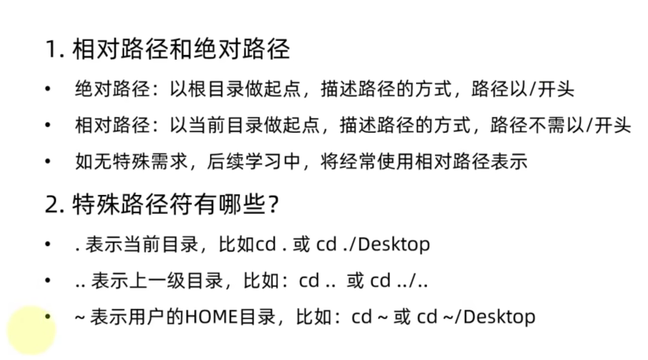
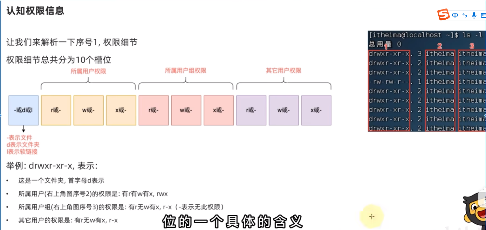
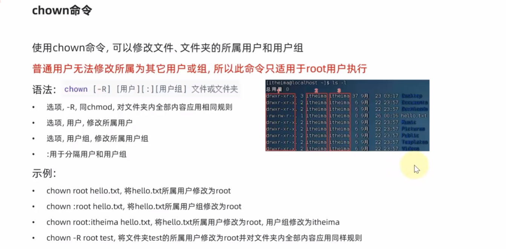
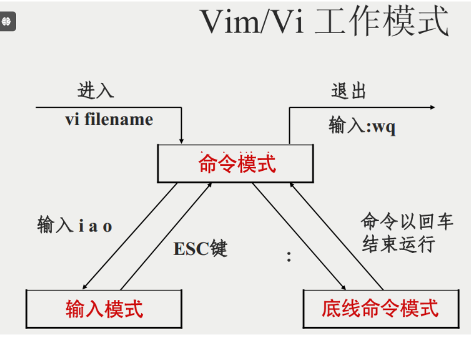
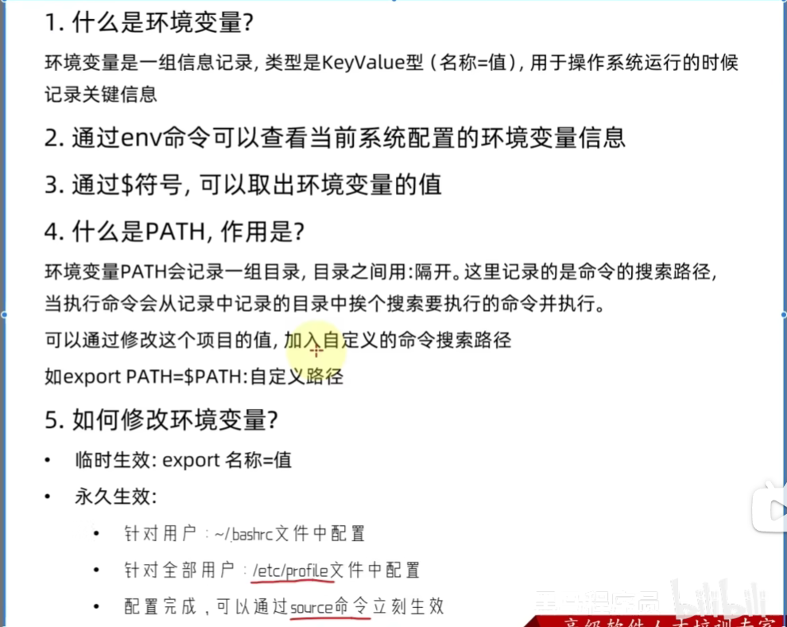

### 1.文件操作
**(1)常见命令**
* **ls (列出目录)**

* **cd (切换目录)和 pwd (显示目前所在的目录)**

**特殊路径符**：

*  **mkdir (创建新目录)**
C}9W{YW.png>)
-m ：配置文件的权限喔！直接配置，

*  **rmdir (删除空的目录)**
语法：rmdir [-p] 目录名称
选项与参数：-p ：从该目录起，一次删除多级空目录
* **cp 和 mv 命令**
[MDOLVA}DM.png>)

* **rm (移除文件或目录)**
语法：rm [-fir] 文件或目录
选项与参数：
-f ：就是 force 的意思，忽略不存在的文件，不会出现警告信息；
-i ：互动模式，在删除前会询问使用者是否动作
-r ：递归删除啊！最常用在目录的删除了！这是非常危险的选项！！！

* **Linux 文件内容查看**
Linux系统中使用以下命令来查看文件的内容：

**cat**   由第一行开始显示文件内容
  
**tac**  从最后一行开始显示，可以看出 tac 是 cat 的倒着写！

**nl** 显示的时候，顺道输出行号！

**more** 一页一页的显示文件内容

**less** 与 more 类似，但是比 more 更好的是，他可以往前翻页！

**head** 只看头几行

**tail** 只看尾巴几行

A87.png)
* 查找命令
MQLZI{NB89D0LCDB(EDC.png>)

**(2)文件基本属性**

JG{BM.png>)
3LS[GTZRELUP2X`Q7]17.png>)

### 2.磁盘操作
Linux 磁盘管理常用三个命令为 df、du 和 fdisk。
df（英文全称：disk free）：列出文件系统的整体磁盘使用量
du（英文全称：disk used）：检查磁盘空间使用量
fdisk：用于磁盘分区

**(1)df命令**
功能：检查文件系统的磁盘空间占用情况。可以利用该命令来获取硬盘被占用了多少空间，目前还剩下多少空间等信息。
语法：df [-ahikHTm] [目录或文件名]
选项与参数：
-h：以人类可读的方式显示输出结果（例如，使用 KB、MB、GB 等单位）。

-T：显示文件系统的类型。

-t <文件系统类型>：只显示指定类型的文件系统。

-i：显示 inode 使用情况。

-H：该参数是 -h 的变体，但是使用 1000 字节作为基本单位而不是 1024 字节。这意味着它会以 SI（国际单位制）单位（例如 MB、GB）而不是二进制单位（例如 MiB、GiB）来显示磁盘使用情况。

-k：这个选项会以 KB 作为单位显示磁盘空间使用情况。

-a：该参数将显示所有的文件系统，包括虚拟文件系统，例如 proc、sysfs 等。如果没有使用该选项，默认情况下，df 命令不会显示虚拟文件系统。

**(2)du 命令**
Linux du 命令也是查看使用空间的，但是与 df 命令不同的是 Linux du 命令是对文件和目录磁盘使用的空间的查看，还是和df命令有一些区别的，这里介绍 Linux du 命令。
语法：du [-ahskm] 文件或目录名称
选项与参数：

-a ：列出所有的文件与目录容量，因为默认仅统计目录底下的文件量而已。

-h ：以人们较易读的容量格式 (G/M) 显示；

-s ：仅显示指定目录或文件的总大小，而不显示其子目录的大小。

-S ：包括子目录下的总计，与 -s 有点差别。

-k ：以 KBytes 列出容量显示；

-m ：以 MBytes 列出容量显示

**(3)fdisk**
fdisk 是 Linux 的磁盘分区表操作工具。
语法：fdisk [-l] 装置名称

选项与参数：
-l ：输出后面接的装置所有的分区内容。若仅有 fdisk -l 时， 则系统将会把整个系统内能够搜寻到的装置的分区均列出来

### 3.vim编辑
TB5]%UQCBYA2N6V.png>)

在底线命令模式中，基本的命令有（已经省略了冒号）：
:w：保存文件。

:q：退出 Vim 编辑器。

:wq：保存文件并退出 Vim 编辑器。

:q!：强制退出Vim编辑器，不保存修改。

### 4. apt 命令
apt（Advanced Packaging Tool）是一个在 Debian 和 Ubuntu 中的 Shell 前端软件包管理器。

apt 命令提供了查找、安装、升级、删除某一个、一组甚至全部软件包的命令，而且命令简洁而又好记。

apt 命令执行需要超级管理员权限(root)。

apt 语法: apt [options] [command] [package ...]

options：可选，选项包括 -h（帮助），-y（当安装过程提示选择全部为"yes"），-q（不显示安装的过程）等等。

command：要进行的操作。

package：安装的包名。
### 5. 环境变量

### 6.其他常见命令
K$F[2~(9QW~V@~EH8E]_N.png>)

