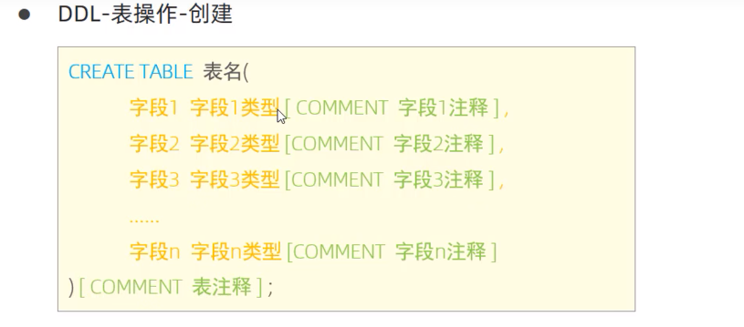
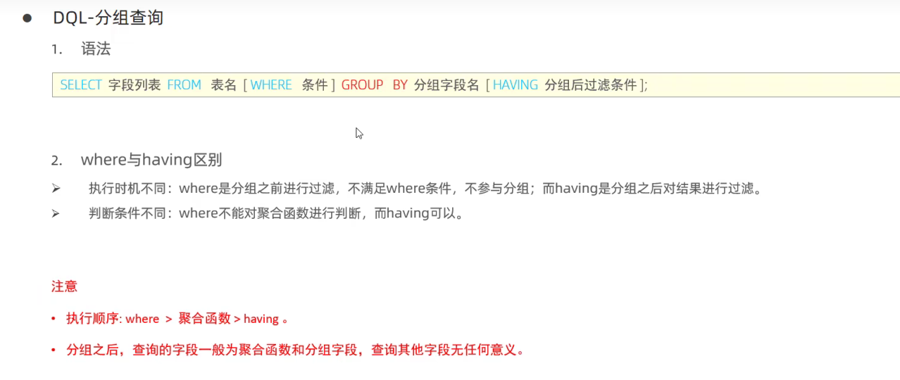
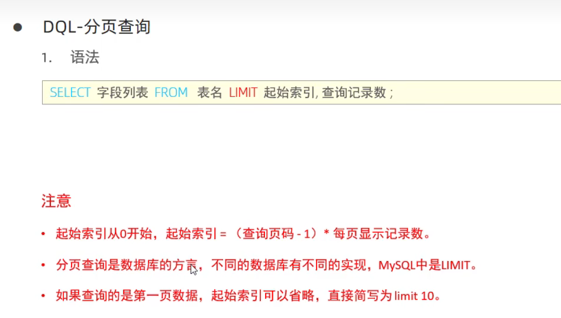
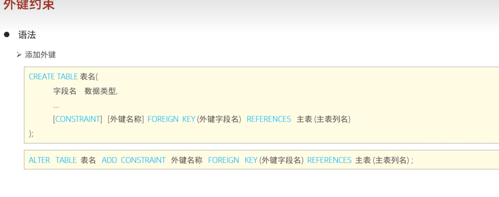
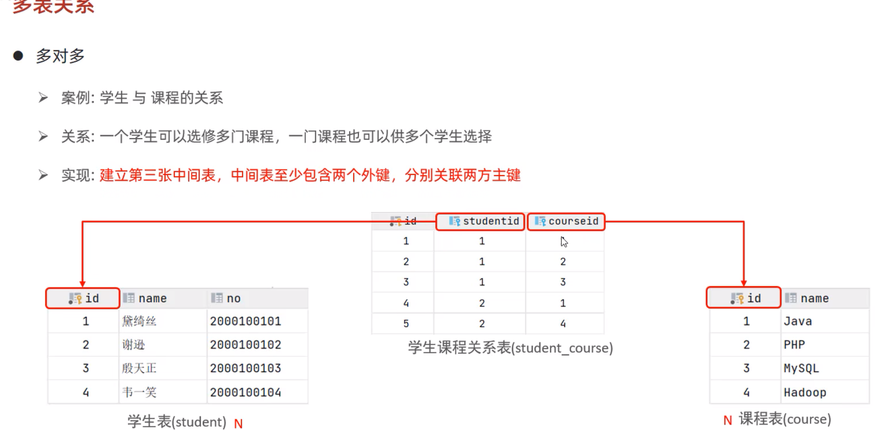
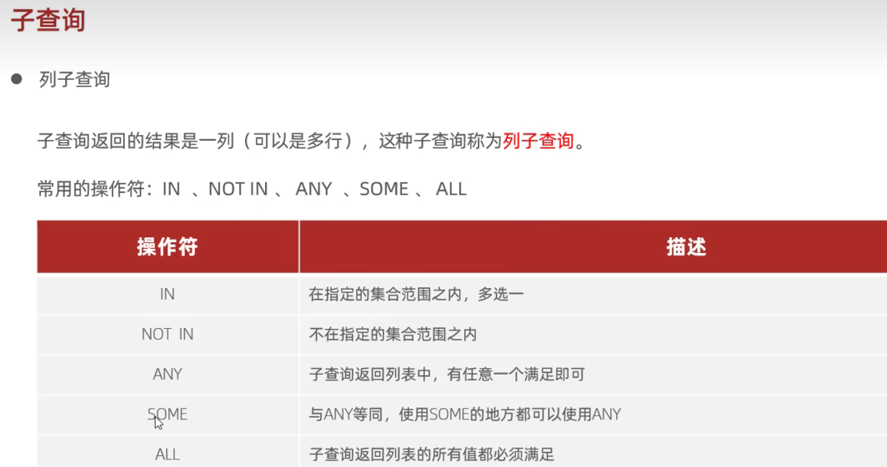

### 1.对数据库和表操作

1.查询所有数据库
```java
查询所有数据库：
show databases;

查询当前数据库：
select database();

创建：
create database [if not exists]数据库名 [default charset 字符集] [collate 排序规则]

删除：
drop database [if exists] 数据库名

使用：
use 数据库名；
```
2.表操作
```java
查看当前数据库所有表
show tables;
查询表结构
desc 表名；
查询建表语句
show create table 表名；

添加字段
alter table 表名 add 字段名 类型（长度）[comment 注释][约束]
修改
alter table 表名 change 旧字段名 新字段名 类型（长度）[comment 注释][约束]
修改表名
alter table 表名 rename to 新表名
删除
drop table [if exists]表名

```


### 2.数据类型
(1)数值类型
TFCOEQCMDB`9FPP11E0X.png>)

(2)字符串类型


(3)日期类型


### 3.对表中数据操作
(1)添加数据
```java

//指定字段
insert into 表名 （字段名1,2,..）values(值1,2,...);
//所有
insert into values(值1,2...);
```
(2)修改数据
```java
update 表名 set 字段名=值（可多个） where [条件];
```
(3)删除数据
delete from 表名 [where 条件]
### 4.对表中数据查询
总体：
(1)聚合函数
1YTCYUJV3{P1FH~Q5I.png>)
(2)分组查询

(3)排序查询
8]$(NAV9.png>)
(4)分页查询

(5)约束
QGN4$M`TUZCHYC.png>)


### 5.多表关系和多表查询
(1)一对多
9RN_%T1)C)TKLHD.png>)
(2)多对多

(3)一对一
)X$}P5PNJWG.png>)
(4)内连接

(5)外连接
F6JDQ44Q]N.png)
(6)自连接

{_95[]`P9.png>)
(7)联合查询

(8)子查询




